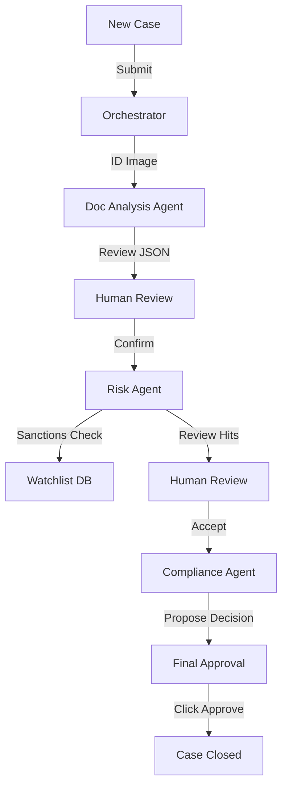

# User Guide: KYC Dashboard Platform

## 1. Functional Overview
The **Agentic KYC (Know Your Customer) Platform** represents the shift from "Task Automation" to "Agentic Orchestration". KYC is traditionally a disjointed process involving separate teams for document verification, background checks, and risk scoring. This platform deploys a "Swarm" of specialized AI Agents that collaborate to complete the case end-to-end.

### Business Value
*   **End-to-End Autonomy**: The system handles the entire workflow—from document upload to final approval—without human touch for clear-cut cases.
*   **Specialization**: Uses distinct "Personas". The "Risk Agent" is conservative and paranoid; the "Sales Agent" (if present) wants to onboard quickly. The "Orchestrator" balances these competing goals.
*   **Scalability**: Can process 10,000 applications in parallel, whereas a human team is limited by headcount.
*   **Audit Lineage**: Every internal conversation between agents is logged. You can see the Risk Agent asking the Doc Agent, "Are you sure that passport isn't expired?"

### System Workflow

## 2. Launching the Tools
*   **Document Analysis Agent**: Uses OCR and Computer Vision (Mock/Real) to extract 50+ fields from ID cards and proof of address.
*   **Risk Agent**: Checks names against Sanctions Lists (OFAC), PEP (Politically Exposed Persons) databases, and adverse media.
*   **Compliance Agent**: The final decision maker. It aggregates the findings from Doc and Risk agents to issue a final verdict based on the bank's risk appetite.

## 3. Launching the Tool
*   **Direct URL**: `http://localhost:5175`

## 3. Step-by-Step Walkthrough

### A. The Dashboard
*   View a list of active cases. Note the statuses: "New", "Processing", "Approved".

### B. Starting a New Case
1.  Click **"+ New KYC Case"**.
2.  **Upload**: Select an ID Card image (e.g., `sample_id.jpg`).
3.  **Auto-Submission**: The system automatically creates the case and begins processing upon upload.

### C. The Interactive Workflow (Human-in-the-Loop)
Unlike a black box, this demo allows you to verify each agent's output:
1.  **Review Docs**: The "Doc Analysis Agent" extracts the name/ID.
    *   *Action*: Users can edit the text (e.g., correct a typo).
    *   *Click*: **"✅ Confirm & Verify"**.
2.  **Review Checks**: The "Risk Agent" runs background checks (OFAC, Watchlists).
    *   *Display*: "Sanctions Check: Passed/Failed".
    *   *Click*: **"✅ Accept Checks"**.
3.  **Review Risk**: The system calculates a score (0-100).
    *   *Display*: "Risk Score: 10/100 (Low)".
    *   *Click*: **"✅ Accept Risk Score"**.
4.  **Final Decision**: The "Compliance Agent" proposes a verdict.
    *   *Click*: **"✅ Final Approve"** to close the case.

### D. Testing Sanctions (Red Flag)
1.  **Upload**: Start a new case with any ID.
2.  **Edit**: In the "Review Docs" step, manually change the "Full Name" to **"Osama Bin Laden"** or **"Tony Soprano"**.
3.  **Proceed**: Click "Confirm & Verify".
4.  **Result**: Protocol will flag a "High Risk" hit in the next step, leading to a "Manual Review" recommendation.

## 4. Tech Note
*   This system uses **Agent-to-Agent Handoffs**. The output of the Doc Agent becomes the *input* context for the Risk Agent.
