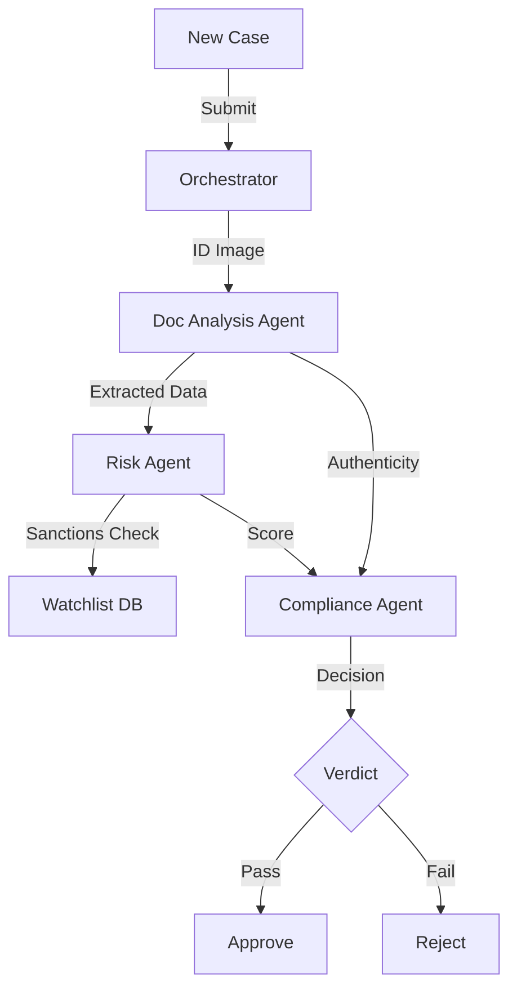

# User Guide: KYC Dashboard Platform

## 1. Functional Overview
The **Agentic KYC (Know Your Customer) Platform** represents the shift from "Task Automation" to "Agentic Orchestration". KYC is traditionally a disjointed process involving separate teams for document verification, background checks, and risk scoring. This platform deploys a "Swarm" of specialized AI Agents that collaborate to complete the case end-to-end.

### Business Value
*   **End-to-End Autonomy**: The system handles the entire workflow—from document upload to final approval—without human touch for clear-cut cases.
*   **Specialization**: Uses distinct "Personas". The "Risk Agent" is conservative and paranoid; the "Sales Agent" (if present) wants to onboard quickly. The "Orchestrator" balances these competing goals.
*   **Scalability**: Can process 10,000 applications in parallel, whereas a human team is limited by headcount.
*   **Audit Lineage**: Every internal conversation between agents is logged. You can see the Risk Agent asking the Doc Agent, "Are you sure that passport isn't expired?"

### System Workflow

## 2. Launching the Tools
*   **Document Analysis Agent**: Uses OCR and Computer Vision (Mock/Real) to extract 50+ fields from ID cards and proof of address.
*   **Risk Agent**: Checks names against Sanctions Lists (OFAC), PEP (Politically Exposed Persons) databases, and adverse media.
*   **Compliance Agent**: The final decision maker. It aggregates the findings from Doc and Risk agents to issue a final verdict based on the bank's risk appetite.

## 3. Launching the Tool
*   **Direct URL**: `http://localhost:5175`

## 3. Step-by-Step Walkthrough

### A. The Dashboard
*   View a list of active cases. Note the statuses: "New", "Processing", "Approved".

### B. New Onboarding
1.  **Input**: Enter "Juan Garcia" and upload dummy ID images.
2.  **Processing (The Swarm)**:
    *   Step 1: **Doc Agent** validates the ID expiry date. (Status: Valid).
    *   Step 2: **Risk Agent** takes the name "Juan Garcia" and searches OFAC. (Status: Clean).
    *   Step 3: **Compliance Agent** sees both "Valid" and "Clean".
3.  **Verdict**: "APPROVED".

### C. The Sanction Hit
1.  **Input**: Enter a name known to the mock watchlist (e.g., "Osama" or "Tony Soprano").
2.  **Processing**:
    *   **Risk Agent**: "ALERT: Name match found in High Risk Database."
3.  **Verdict**: "MANUAL_REVIEW". The agent refuses to auto-approve and routes it to a human queue.

## 4. Tech Note
*   This system uses **Agent-to-Agent Handoffs**. The output of the Doc Agent becomes the *input* context for the Risk Agent.
