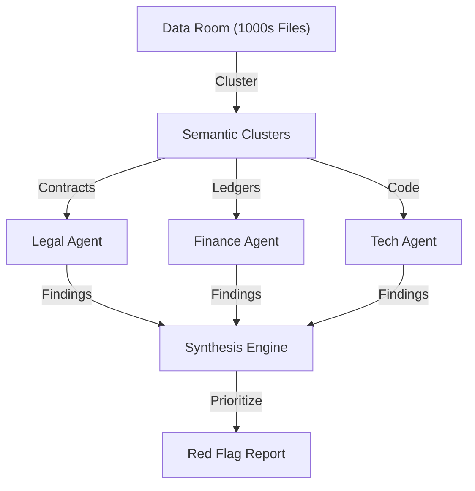

# User Guide: AI DDO (Due Diligence Operations)

## 1. Functional Overview
**AI DDO** is a heavy-lifting agent designed for the high-stakes world of Mergers & Acquisitions (M&A). When Company A buys Company B, they must review thousands of documents (Contracts, Patents, Org Charts, Tax Returns) in a "Data Room" to find risks. This is typically done by an army of junior lawyers burning the midnight oil. AI DDO automates this document crunching.

### Business Value
*   **Speed**: Analyzing a 10GB Data Room in hours instead of weeks.
*   **Risk Identification**: Catching "Poison Pills" (e.g., a contract clause that allows a major revenue source to walk away if the company is sold) that tired humans might miss.
*   **Cost Reduction**: Reducing the legal billable hours significantly.
*   **Valuation Accuracy**: Helping the Investment Committee make a more informed bid based on the true state of the target's assets/liabilities.

### Key Capabilities
*   **Hierarchical Clustering**: The agent intelligently organizes a mess of unlabelled files into a structured taxonomy (Legal/Finance/HR).
*   **Multi-Agent Swarm**:
    *   **Legal Agent**: Reviews contracts for change-of-control, liability caps, and expiry.
    *   **Financial Agent**: Extracts EBITDA, Debt schedules, and recurring revenue metrics.
    *   **Tech Agent**: Reviews IP assignments and software licenses.
*   **Meta-Analysis**: Synthesizing findings across domains (e.g., "Legal says we own the IP, but Finance shows we are paying royalties for it -> Discrepancy").

### System Workflow

## 2. Launching the Tool
*   **Direct URL**: `http://localhost:5182`

## 3. Step-by-Step Walkthrough

### A. Ingestion
1.  **Pointing**: Select the "Sample Data Room" (Mock folder of PDFs).
2.  **Process**: Watch the progress bar as the system OCRs and Indexes the content.

### B. The "Red Flag" Report
1.  Click **"Analyze Risks"**.
2.  **Output**: A matrix of High/Medium/Low risks.
    *   *High Risk*: "Pending Litigation found in `court_docs_2023.pdf`. Potential liability $2M."
    *   *Medium Risk*: "lease agreement for HQ expires in 6 months."

### C. Q&A (Deep Dive)
1.  **Ask**: "Who are the top 3 customers by revenue?"
2.  **Agent**: Scans Master Service Agreements (MSAs) and Invoices to compile a ranked list.
3.  **Ask**: "Are there any non-compete clauses for the Founders?"
4.  **Agent**: "Yes, Founder X has a 2-year non-compete. See `Employment_Contract_Founder.pdf` Page 4."

## 4. Tech Note
*   This tool uses **Large Context Windows** and **Reflective Search** to handle document-level reasoning rather than just sentence-level retrieval.
