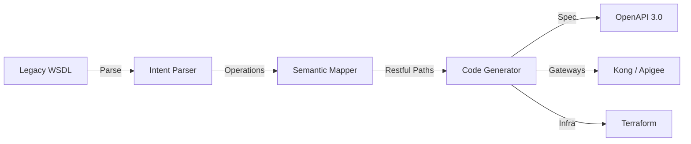

# User Guide: API Transformation Agent

## 1. Functional Overview
The **API Transformation Agent** is a developer productivity multiplier designed to solve the "Legacy Debt" crisis. Enterprises are stuck with thousands of ancient SOAP services, WSDLs, and monolithic interfaces that are incompatible with modern Cloud/Mobile apps. Manually rewriting these to REST/OpenAPI is tedious, error-prone, and slow. This agent automates the semantic translation.

### Business Value
*   **Acceleration**: Reduces API modernization time from weeks (manual analysis + coding) to minutes.
*   **Standardization**: Enforces modern governance standards (naming conventions, security schemas) automatically during generation.
*   **Infrastructure-Ready**: Doesn't just generate code; it generates the *infrastructure* (Terraform, Gateway Config) needed to deploy it, bridging the gap between Dev and Ops.
*   **Preservation of Intent**: Uses LLMs to understand the *business intent* of a cryptic legacy field (e.g., `CUST_DOB_8`) and maps it to a readable modern equivalent (`customer.dateOfBirth`).

### Key Capabilities
*   **Intelligent Parsing**: Can ingest WSDL, RAML, or even raw Java Interfaces.
*   **Semantic Mapping**: "Thinking" about the best HTTP verb. (e.g., "This SOAP operation 'UpdateAddress' should be a `PATCH` on `/customer/{id}/address`").
*   **Multi-Output Generation**: Produces OpenAPI 3.0 Specs, Kong/Apigee Gateway Configs, and Azure APIM Terraform modules simultaneously.

### System Workflow

## 2. Launching the Tool
*   **Direct URL**: `http://localhost:8505`

## 3. Step-by-Step Walkthrough

### A. The Input
1.  **Source**: Select "Legacy WSDL".
2.  **Upload**: Drag the `AccountService.wsdl` file.
3.  **Agent Analysis**: The agent reads the XML structures (`ComplexTypes`, `PortTypes`).

### B. The Mapping Strategy
*   The UI displays a "Proposed Map".
*   **Review**: You see `GetAccountBalance` -> `GET /accounts/{id}/balance`.
*   **Correction**: If the agent guessed wrong (e.g., mapped a sensitive update to `GET`), you can correct it to `POST` in the chat instructions.

### C. The Artifacts
1.  Click **"Generate Assets"**.
2.  **Download Bundle**:
    *   `openapi.yaml`: The clean, modern contract.
    *   `kong.yaml`: Ready to `kubectl apply` to your Kubernetes cluster.
    *   `azure.tf`: Ready to `terraform apply` to provision the API Management Service.

## 4. Advanced
*   **Linter**: The integrated Spectral Linter instantly grades the generated spec (e.g., Score: 95/100), ensuring you don't commit low-quality specs.
