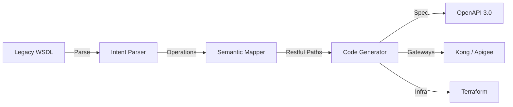

# User Guide: API Transformation Agent

## 1. Functional Overview
The **API Transformation Agent** is a developer productivity multiplier designed to solve the "Legacy Debt" crisis. Enterprises are stuck with thousands of ancient SOAP services, WSDLs, and monolithic interfaces that are incompatible with modern Cloud/Mobile apps. Manually rewriting these to REST/OpenAPI is tedious, error-prone, and slow. This agent automates the semantic translation.

### Business Value
*   **Acceleration**: Reduces API modernization time from weeks (manual analysis + coding) to minutes.
*   **Standardization**: Enforces modern governance standards (naming conventions, security schemas) automatically during generation.
*   **Infrastructure-Ready**: Doesn't just generate code; it generates the *infrastructure* (Terraform, Gateway Config) needed to deploy it, bridging the gap between Dev and Ops.
*   **Preservation of Intent**: Uses LLMs to understand the *business intent* of a cryptic legacy field (e.g., `CUST_DOB_8`) and maps it to a readable modern equivalent (`customer.dateOfBirth`).

### Key Capabilities
*   **Intelligent Parsing**: Can ingest WSDL, RAML, or even raw Java Interfaces.
*   **Semantic Mapping**: "Thinking" about the best HTTP verb. (e.g., "This SOAP operation 'UpdateAddress' should be a `PATCH` on `/customer/{id}/address`").
*   **Multi-Output Generation**: Produces OpenAPI 3.0 Specs, Kong/Apigee Gateway Configs, and Azure APIM Terraform modules simultaneously.

### System Workflow

## 2. Launching the Tool
*   **Direct URL**: `http://localhost:5176`

## 3. Step-by-Step Walkthrough

### B. Running a Transformation
1.  **Select Source**: Choose "WEBMETHODS" or "TIBCO" from the dropdown.
2.  **Select Target**: Choose "SPRINGBOOT" or "AWS LAMBDA".
3.  **Upload**: Click the upload area to select a Config File (XML, Zip, YAML).
4.  **Execute**: Click **"Start Migration"**.

### C. Reviewing Results
1.  **Generated Config**: The right-hand panel displays the converted code (YAML/HCL).
2.  **Validation**: Syntax highlighting ensures readability.
3.  *Note: Deployment is manual in this version.*

## 4. Advanced
*   **Linter**: The integrated Spectral Linter instantly grades the generated spec (e.g., Score: 95/100), ensuring you don't commit low-quality specs.
