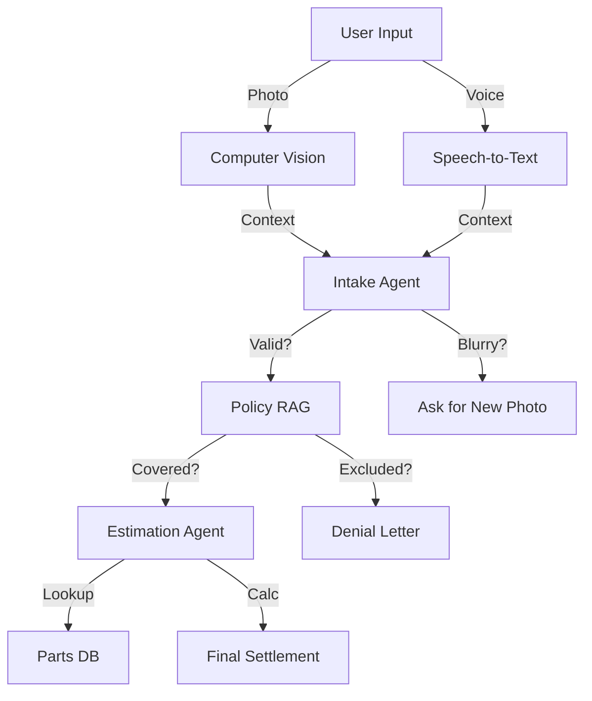

# User Guide: Autonomous Claims Adjuster

## 1. Functional Overview
The **Autonomous Claims Adjuster** transforms the "First Notice of Loss" (FNOL) experience from a multi-day ordeal into a minutes-long interactive session. In traditional insurance, filing a claim involves call centers, waiting for inspectors, and manual form filling. This agent uses **Multimodal AI** to handle the entire intake, verification, and estimation process instantly.

### Business Value
*   **Zero-Touch Settlement**: For simple, high-frequency claims (like a cracked windshield or minor bumper dent), the agent can approve and pay out the claim without human intervention, reducing operational costs by ~90%.
*   **Fraud Reduction**: By analyzing metadata and visual evidence immediately at the scene (via the user's phone), it reduces the window for "Staged Accidents."
*   **Customer Satisfaction (NPS)**: Customers get an immediate resolution ("Instant Gratification") rather than a reference number and a 3-day wait.
*   **Standardization**: Applies policy rules consistently every time, eliminating human bias or fatigue in decision-making.

### Key Capabilities
*   **Computer Vision**: Analyzing user-uploaded photos to detect damage type (Dent, Scratch, Smash) and severity.
*   **Voice Processing**: Transcribing and analyzing the driver's spoken narrative of the accident.
*   **Policy RAG**: Checking the specific coverage details (e.g., deductible amount, exclusions) effectively.
*   **Estimation Engine**: Accessing real-time parts and labor databases (simulated) to generate a fair settlement offer.

### System Workflow

## 2. Launching the Tool
*   **Direct URL**: `http://localhost:8501`

## 3. Step-by-Step Walkthrough

### A. The "Happy Path" (Settlement)
1.  **Inputs**: Select "Clear Photo" and leave the transcript as "Rock hit windshield".
2.  **Process**: Watch the agent (Sidebar) tick off steps: Intake -> Coverage Check -> Pricing.
3.  **Outcome**: "Claim Approved. Transferring $450 to your account."

### B. The "Exceptions" (Human Loop)
1.  **Input**: Select "Blurry Photo".
2.  **Logic**: Computer Vision confidence drops below threshold (e.g., < 80%).
3.  **Outcome**: The Agent *pauses* and asks the user: "I cannot clearly see the damage. Please upload a better photo." This demonstrates the "Human-in-the-Loop" architecture.

## 4. Configuration
*   **Provider**: Switch between Azure, AWS, and Google to test different LLM reasoning capabilities.
