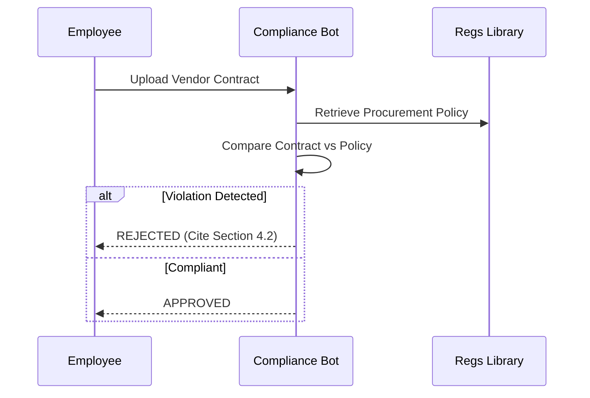

# User Guide: Compliance Bot

## 1. Functional Overview
The **Compliance Bot** serves as an intelligent "Regulatory Firewall" for the enterprise. In heavily regulated industries (Banking, Insurance, Healthcare), a single non-compliant email or contract can result in multi-million dollar fines. This agent proactively scans communications and documents against a library of laws (GDPR, HIPAA, CCPA) and internal standards.

### Business Value
*   **Risk Mitigation**: Catching violations (e.g., sending PII via unencrypted email) *before* they occur.
*   **Audit Readiness**: Maintaining a perfect audit trail of why a decision was made, citing the specific paragraph of the law.
*   **Operational Velocity**: Reducing the backlog of Legal Review. Instead of waiting a week for a lawyer to review a marketing brochure, the Agent provides initial feedback in seconds.
*   **Education**: Acting as a coach, explaining *why* something is non-compliant so employees learn.

### Key Capabilities
*   **Policy Comparison**: It doesn't just search; it *reasons*. "Does this clause in the Vendor Contract contradict our Data Privacy Policy?"
*   **Conflict Detection**: Identifying when two policies conflict (e.g., "Data Retention Policy says delete after 3 years, but Tax Law says keep for 7").
*   **Multilingual Support**: (Implicit in LLM) Can review contracts in foreign languages and map them to local regulations.

### System Workflow

## 2. Launching the Tool
*   **Direct URL**: `http://localhost:8504`

## 3. Step-by-Step Walkthrough

### A. The Travel Policy Check
1.  **Select Policy**: "Global Travel Expense Policy 2024".
2.  **Scenario**: User uploads a receipt for a "Business Class Flight to Paris ($5,000)".
3.  **Agent Logic**:
    *   Retrieves: "flights < 6 hours must be Economy."
    *   Retrieves: "VP level and above exceptions."
4.  **Verdict**: "REJECTED. Flight duration is 4 hours. No VP status detected."

### B. The Contract Scan
1.  **Upload**: `Vendor_Agreement_Draft.pdf`.
2.  **Scan**: The agent highlights Clause 4.2.
3.  **Flag**: "Missing 'Right to Audit' clause, which is mandatory for all Tier-1 suppliers per Procurement Policy."

## 4. Configuration
*   **Vector Store**: Upload new PDF policies into the `knowledge_base` folder to instantly update the bot's brain without retraining.
