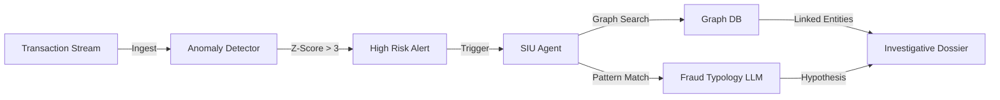

# User Guide: Fraud Investigator Agent

## 1. Functional Overview
The **Fraud Investigator Agent** acts as an automated "Special Investigations Unit" (SIU). Insurance fraud costs the industry billions annually, often utilizing sophisticated methods like "Ghost Broking" (selling fake policies) or "Crash for Cash" rings. Human investigators cannot monitor every transaction in real-time; this Agent does.

### Business Value
*   **Real-Time Interdiction**: Blocking a fraudulent policy *before* it is issued, rather than chasing the money after a claim is paid.
*   **Network Discovery**: Detecting hidden connections (e.g., 50 different claimants all using the same IP address or Bank Account Number) that a human looking at a single case would miss.
*   **Explainable AI**: The agent produces a "Dossier" explaining *why* it flagged a case (e.g., "High velocity of applications from single device"), ensuring compliance with Fair AI standards.
*   **Triage Efficiency**: Sorting alerts into "False Positive", "Review", and "Critical", allowing human experts to focus only on high-value cases.

### Key Capabilities
*   **Statistical Anomaly Detection**: Computing Z-Scores on application velocity and claim amounts.
*   **Graph Analysis**: Traversing links between Entities (People, Phones, IPs).
*   **Contextual Reasoning**: Using LLMs to compare current behavior against known Fraud Typologies (e.g., "The pattern matches a Jump-In passenger scheme").

### System Workflow

## 2. Launching the Tool
*   **Direct URL**: `http://localhost:8502`

## 3. Step-by-Step Walkthrough

### A. Monitoring
*   The dashboard shows a live ticker of incoming applications. Most are "Green" (Normal).

### B. The Attack Simulation
1.  Sidebar: Select **"Simulate Attack: Ghost Broker"**.
2.  **Observe**: A burst of 5-10 applications appears in the feed.
3.  **Detection**: The "Anomaly Score" gauge spikes into the Red zone.
4.  **Investigation**: The Agent auto-triggers a "Deep Dive". It queries the history of the IP address `192.168.1.X`.
5.  **Result**: "ALERT: Ring Detected. 12 Policies linked to one device."

### C. The Report
*   Open the generated **"Investigation Dossier"**. It contains a summary for the police/legal team.

## 4. Troubleshooting
*   **No Alerts?**: Click the "Simulate" button multiple times rapidly to force the statistical threshold to be breached.
