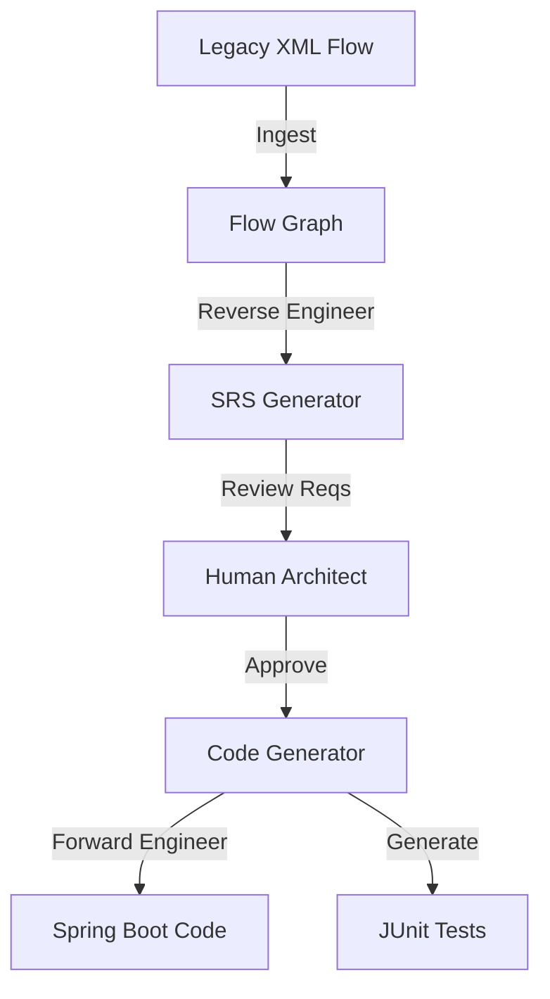

# User Guide: Integration Migration Agent

## 1. Functional Overview
The **Integration Migration Agent** targets the specific niche of "Middleware Replatforming". Many large enterprises are moving away from expensive, proprietary Enterprise Service Buses (TIBCO, webMethods, MuleSoft) toward lightweight, cloud-native microservices (Spring Boot, Camel, Logic Apps). This tool reverse-engineers the proprietary logic and rewrites it in open standards.

### Business Value
*   **Vendor Lock-in Removal**: Eliminates dependency on expensive legacy licensing by moving to open-source or cloud-native targets.
*   **Logic Extraction**: Legacy logic is often undocumented ("Black Box"). The agent extracts the flow and explains *what* it does in plain English before converting it.
*   **Test Generation**: A major risk in migration is regression. This agent auto-generates JUnit tests based on the inferred logic to ensure the new code behaves exactly like the old code.

### Key Capabilities
*   **Pattern Recognition**: Identifying integration patterns like "Scatter-Gather", "Circuit Breaker", or "Content-Based Router" in the legacy XML.
*   **Polyglot Generation**: Can output Java (Spring Boot), Python (FastAPI), or Azure Logic Apps (JSON).
*   **Complexity Scoring**: Estimates the "Difficulty of Migration" (Low/Med/High) to help project managers plan sprints.

### System Workflow

## 2. Launching the Tool
*   **Direct URL**: `http://localhost:5177` (UI)

## 3. Step-by-Step Walkthrough

### A. Assessment
1.  **Upload**: Provide a `flow.xml` from the legacy ESB.
2.  **Dashboard**: See the Complexity Score.
    *   *Lines of Code*: 200.
    *   *Nodes*: 15.
    *   *External Calls*: 3 (Database, CRM, SAP).

### B. The Migration Pipeline
1.  **Ingestion**: Select Source/Target and **Upload** legacy files.
    *   Click **"Initialize Analysis"**.
2.  **Reverse Engineering (SRS)**:
    *   The Agent generates a "Software Requirements Specification".
    *   **Review** the text.
    *   Click **"Approve & Generate Architecture"**.
3.  **Forward Engineering (Code)**:
    *   The Agent generates **Source Code** (Spring Boot) and **Unit Tests** (JUnit).
    *   Review the code in the "Target Artifacts" view.

### C. Refactoring
1.  **Prompt**: "Make this code reactive using WebFlux."
2.  **Result**: The agent rewrites the synchronous `RestTemplate` calls to asynchronous `WebClient` chains.

## 4. Limitations
*   Complex custom scripts (e.g., embedded Groovy/Java in the XML) may require manual review as the agent might not have the full context.
