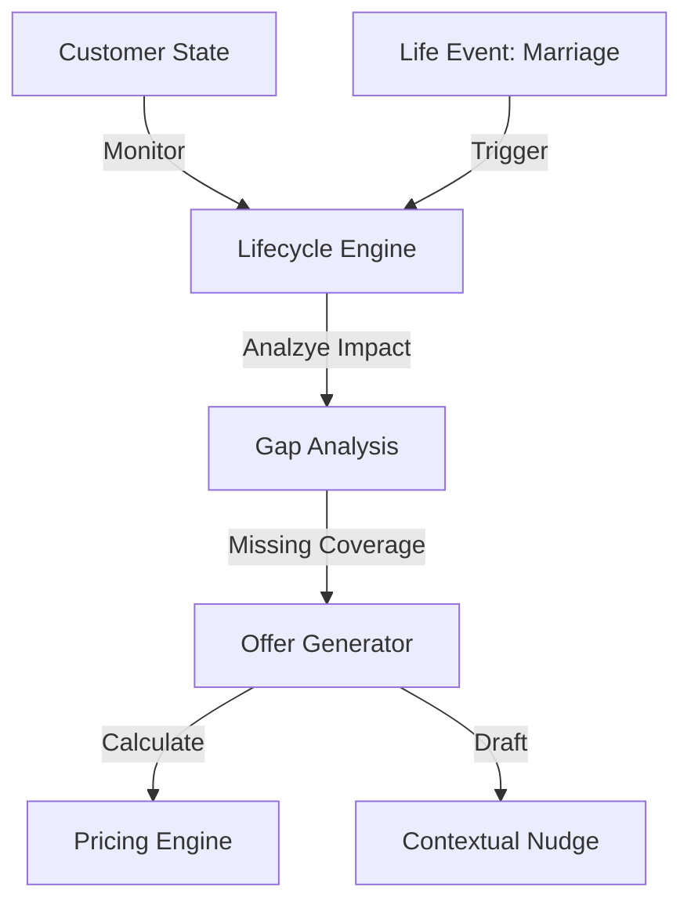

# User Guide: Lifecycle Manager

## 1. Functional Overview
The **Lifecycle Manager** illustrates the shift from "Reactive Insurance" (paying claims) to "Proactive Risk Management" (preventing loss / closing gaps). It serves as a continuous companion to the customer, monitoring their life journey and autonomously suggesting policy adjustments to ensure they are never under-insured.

### Business Value
*   **Customer Lifetime Value (CLV)**: converting single-policy holders into multi-policy loyalists by proactively addressing their needs.
*   **Retention**: Customers feel "cared for" rather than "sold to" when offers are timely and relevant (e.g., offering Pet Insurance the week they adopt a dog).
*   **Sales Efficiency**: Automated "Nudge" emails perform the work of junior agents, allowing humans to focus on closing complex deals.

### Key Capabilities
*   **Event Simulation Engine**: A "Time Machine" that allows you to fast-forward a customer's life (Getting Married, Having Kids, Buying a House) to see how the Agent reacts.
*   **Gap Logic**: Deterministic rules combined with LLM reasoning. "If User owns > $50k jewelry AND Home Policy limit is $2k -> Gap Detected."
*   **Pricing Engine**: Instantly calculating the *incremental* cost of the upgrade (e.g., "+$12/month"), so the offer is actionable immediately.

### System Workflow

## 2. Launching the Tool
*   **Direct URL**: `http://localhost:8506`

## 3. Step-by-Step Walkthrough

### A. The Baseline
*   **Persona**: "John", 25 years old.
*   **Portfolio**: Auto Policy (Sedan).

### B. The Life Event
1.  **Select**: "Marriage".
2.  **Simulate**: The system instantly updates John's demographic state (Status: Married).
3.  **Agent Reaction**:
    *   *Logic*: "Marriage implies shared assets and potential future dependents."
    *   *Gap*: "Lack of Life Insurance."
    *   *Offer*: "Term Life Policy ($500k coverage)."
    *   *Price*: "$25/month."

### C. The Communication
*   Read the **Generated Email**: It uses a congratulatory tone ("Best wishes on your wedding!") and softly pivots to protection ("To protect your new shared future..."). This demonstrates **Tone Matching**.

## 4. Advanced
*   **Multi-Step Events**: Try "Buy House" -> Agent offers Homeowners. Then "Have Child" -> Agent offers higher Liablity limits + Education Savings integration.
