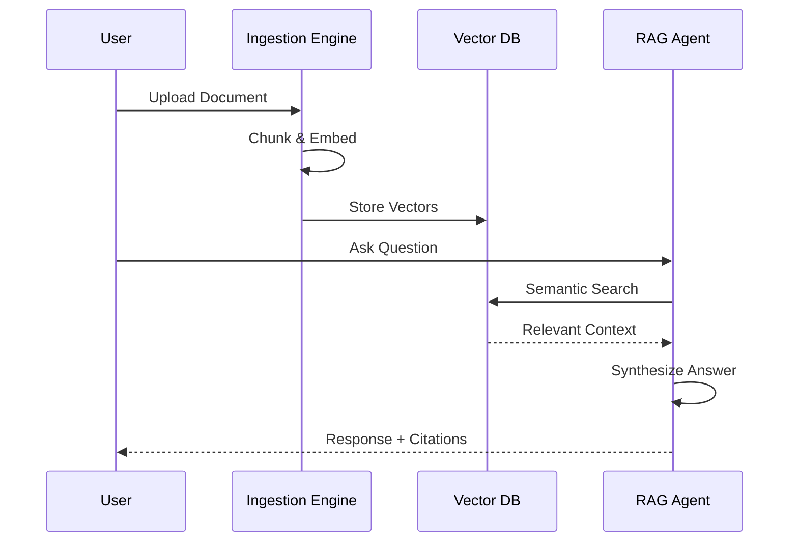

# User Guide: RAG Knowledge Base

## 1. Functional Overview
The **RAG (Retrieval-Augmented Generation) Knowledge Base** solves the problem of "Knowledge Silos" in large organizations. Vital information—Sales Playbooks, HR Policies, Technical Manuals, Compliance Regs—is often trapped in thousands of PDF documents that traditional keyword search cannot effectively query.

### Business Value
*   **Instant Answers**: Instead of searching for "Remote Work" and opening 5 differents PDFs to find the right paragraph, an employee simply asks, "Can I work from Hawaii for a month?" and gets a direct Yes/No answer with citations.
*   **Contextual Understanding**: Unlike Ctrl+F, RAG understands semantic meaning. It knows that "PTO" and "Vacation Time" are related concepts.
*   **Source of Truth**: The AI is grounded *strictly* in the uploaded documents. It is explicitly instructed not to hallucinate or use outside knowledge, ensuring that answers reflect internal company policy only.
*   **Security**: Document embeddings are stored locally or in a secure vector database, ensuring sensitive IP never leaves the enterprise control plane (depending on deployment).

### Key Features
*   **Smart Ingestion**: Automatically OCRs, chunks, and indexes PDFs, Word Docs, and Text files.
*   **Citation Engine**: Every answer includes footnotes pointing to the exact source document and page number, allowing for human verification.
*   **Conversational Memory**: Users can ask follow-up questions ("What about for contractors?") without repeating the context.

### System Workflow

## 2. Launching the Tool
*   **Direct URL**: `http://localhost:5174`

## 3. Step-by-Step Walkthrough

### A. Ingest (Knowledge Administrator)
1.  Go to **Ingest Tab**.
2.  **Upload**: Click to select `Company_Policy_2024.pdf` (or drag & drop).
3.  **Process**: The system automatically OCRs and vectors the text into the database.
4.  *Log*: Watch the activity log for "Success! Doc ID: ...".

### B. Chat (End User)
1.  Go to **Chat Tab**.
2.  Ask: "What is the reimbursement limit for client dinners?"
3.  Review the answer and check the source link.

## 4. Advanced Limits
*   **Chunk Size**: Configurable in `.env`. Smaller chunks (256 tokens) are better for precise fact retrieval; larger chunks (1024) are better for summarization.
