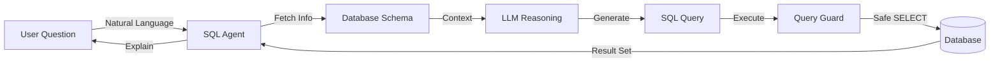

# User Guide: Text-to-SQL Platform

## 1. Functional Overview
The **Text-to-SQL Platform** is designed to democratize access to data. Traditionally, answering a business question like "Who are our top 5 churned customers?" required submitting a ticket to the Data Team and waiting days for a SQL Analyst to run a query. This tool puts that power directly into the hands of Business Analysts and Product Managers.

### Business Problem
*   **Bottleneck**: Data teams are overwhelmed with ad-hoc reporting requests.
*   **Latency**: Business decisions are delayed by the time it takes to retrieve data.
*   **Shadow IT**: Impatient users often export Excel dumps and create error-prone manual reports.

### Solution Features
*   **Natural Language Interface**: Users type questions in plain English (or any language). The Agent translates this into complex SQL (Joins, Aggregations, Window Functions) or NoSQL (MongoDB Aggregation Pipelines) automatically.
*   **Schema Awareness**: The AI understands the specific database structure, including table relationships and column definitions, ensuring accuracy.
*   **Safety Rails**: The `QueryGuard` module ensures the AI only performs `SELECT` (Read) operations and never `DELETE` or `DROP`, making it safe for broad deployment.
*   **Explainability**: It doesn't just give a number; it explains *how* it calculated it (Thinking Process) and shows the raw SQL (Technical Details), building trust with skeptical data pros.
*   **Exportability**: Results can be instantly downloaded as CSV for use in presentations or downstream modeling.

### System Workflow

## 2. Step-by-Step Walkthrough

### A. Configuration
1.  **Settings**: Click the Gear icon.
2.  **Model**: Choose "Azure OpenAI" (Production) or "Mock" (Training).
3.  **Database**: Enter the connection string (e.g., `sqlite:///demo.db`).

### B. Execution Flow
1.  **Input**: Type "Show average order value by Region for 2023."
2.  **Processing**:
    *   Agent analyzes schema (`Orders`, `Customers`).
    *   Agent generates SQL: `SELECT Region, AVG(Total) FROM ...`.
    *   Agent validates syntax.
3.  **Output**: view the resulting table and the SQL used.
4.  **Refine**: "Filter this for only US and Canada." (Conversational Context).

## 3. Visualization
*   **ER Diagram View**: Click the generic "Graph" icon to see an interactive entity-relationship diagram of your connected database.

## 4. Troubleshooting
*   **"Ambiguous Column"**: If the agent asks for clarification, specify which table to use (e.g., "Use Customer Address, not Billing Address").
