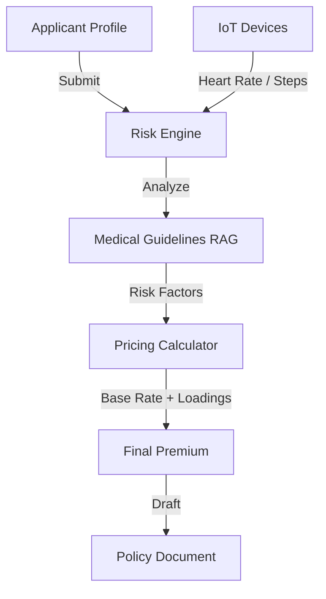

# User Guide: Dynamic Underwriting Agent

## 1. Functional Overview
The **Dynamic Underwriting Agent** revolutionizes the pricing of Life and Health insurance. Traditional underwriting relies on static, historical tables (Actuarial Tables) effectively placing users in broad buckets. This agent enables **Hyper-Personalization** by ingesting real-time data flows (simulated IoT wearables, digital medical records) and news context.

### Business Value
*   **Precision Pricing**: Improving the risk pool by accurately pricing high-risk individuals and rewarding healthy behaviors (e.g., daily steps, gym visits).
*   **Speed to Quote**: Reducing the "Application-to-Offer" time from weeks to seconds.
*   **Dynamic Adjustment**: The ability to adjust premiums dynamically as the user's lifestyle changes (e.g., "Pay-as-you-Live" models).
*   **Transparency**: Providing the applicant with clear reasons for their price, fostering trust and encouraging positive behavioral changes.

### Key Capabilities
*   **IoT Ingestion**: Simulates API connections to Apple Health / Fitbit to fetch heart rate and activity levels.
*   **Medical RAG**: Consults complex medical journals and guideline PDFs to understand conditions (e.g., "Is Type 2 Diabetes insurable for a 30-year-old?").
*   **Calculative Tool Use**: Uses Python-based calculation tools (`calculators.py`) to ensure math accuracy for the final premium (preventing LLM math errors).

### System Workflow

## 2. Launching the Tool
*   **Direct URL**: `http://localhost:8503`

## 3. Step-by-Step Walkthrough

### A. Start New Application
1.  **Sidebar**: Go to "New Application".
2.  **Select Applicant**: Choose **"user123"** (Simulated High Risk) or **"user456"** (Healthy).
3.  **Trigger**: Click **"Start Underwriting"**.
    *   *Effect*: The agent ingests IoT/EHR data in the background and creates a case (`case_user123`).

### B. Underwriter Review
1.  **Dashboard**: Look at the "Underwriter Review Queue".
2.  **Select Case**: Pick `case_user123` from the dropdown.
3.  **Analyze**:
    *   Read the **"Relevant Medical History"** table.
    *   Read the **"Agent Reasoning"** finding gaps.
    *   Review the **"Proposed Policy"** premium ($/mo).
4.  **Decision**:
    *   Select **"Approve"** or **"Reject"** radio button.
    *   Click **"Submit Decision"**.
    *   *Outcome*: The Policy JSON is generated and displayed. Extra" surcharge of $5/mo/1k coverage.
4.  **Policy**: The generated PDF explicitly lists "Exclusion: Death resulting from Scuba incidents."

## 4. Advanced
*   **News Feed**: The agent simulates checking an API for "Regional Health Risks" (e.g., a localized flu outbreak) which could temporarily influence acceptance criteria.
