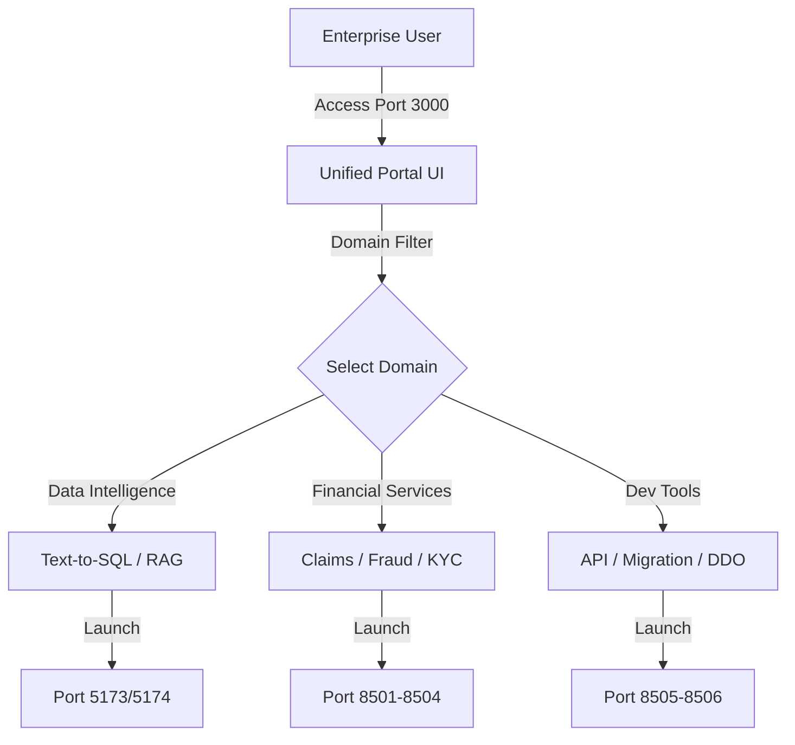

# User Guide: Unified Enterprise Portal

## 1. Functional Overview
The **Unified Enterprise Portal** serves as the central operating system ("Nexus OS") for the modern Agentic Enterprise. In a fragmented landscape where AI tools often exist as siloed experiments, this portal provides a cohesive, single-pane-of-glass experience for all stakeholders—from Data Scientists and Claims Adjusters to Compliance Officers and Developers.

### Business Value
*   **Centralized Access Control**: Instead of bookmarking 12 different URLs, users log in to one dashboard to access the entire suite of intelligence tools.
*   **Role-Based Navigation**: The interface segments tools by domain (Data, FSI, Dev), ensuring that a Claims Officer isn't overwhelmed by API Migration tools, while a CTO can see the full technological landscape.
*   **Unified Design Language**: All applications share a common aesthetic and UX pattern (Glassmorphism, Dark Mode), reducing cognitive load and training time for employees moving between modules.
*   **Scalability**: The modular architecture allows IT teams to "plug in" new agents as micro-frontends without rewriting the core platform. It acts as an App Store for internal enterprise AI capabilities.

### Key Capabilities
*   **Domain Filtering**: Instantly toggle between "Financial Services", "Developer Tools", and "Data Intelligence" views.
*   **Health Monitoring**: Visual indicators (glow effects) show which agents are active and healthy.
*   **Launchpad**: One-click deep linking to the specific context of each agent.

### System Workflow

## 2. Launching the Portal
*   **Prerequisites**: Ensure `start_all.sh` is running.
*   **URL**: `http://localhost:3000`

## 3. Navigation Guide
### The Dashboard
*   **Domain Filters**: Use the pill-buttons at the top to filter the grid.
*   **Agent Cards**: Each card displays a title, description, and status color.
    *   **Blue/Indigo**: Data Tools.
    *   **Green/Teal**: Business/FSI Tools.
    *   **Purple/Cyan**: Technical/Dev Tools.

### Global Navigation
*   **Settings ⚙️**: Configure global preferences (Simulated).
*   **Home 🏠**: Return to the main grid from any sub-view.

## 4. Troubleshooting
*   **Blank Screen**: Hard refresh (`Cmd+Shift+R`).
*   **Card Not Clicking**: Ensure the target service (e.g., port 5173) is up.
